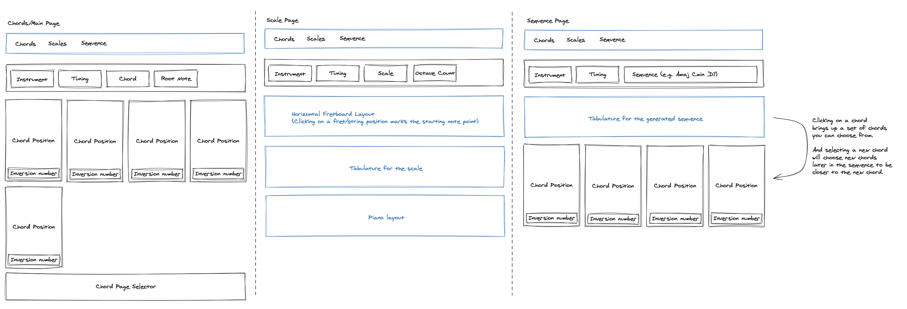

jm-glass
========

A glassmorphic UI around the chord/scale/sequence generating engine.

# High Level Design

We'll get more detailed as we go, but the high level design for the site would look something like this:

* **Chords/Main Page** - On this page the customer can select their instrument and tuning, as well as the chord spelling (Major, Minor, etc.) and then be presented with a set of chords that match that specification.
* **Scale Page** - On this page the customer can select their instrument and tuning, as well as the scale they want to use and the number of octaves they want to play. Below that is a horizontally oriented fretboard that the customer can click on to select the starting position of the scale. As well as a slider they can use to select the string span (defaulting to 5). The string span tells the algorithm how many frets it should follow on the current string before switching to the next string. Below the horizontal fretboard is a tabulature display that shows the same scale but in [tabulature form](https://en.wikipedia.org/wiki/Tablature), and a piano component that shows the same scale on a piano keyboard.
* **Sequence Page** - On this page the customer can select their instrument and tuning, and then type in a sequence of root notes and chords. The algorithm will then parse the text and find a sequence of chords that match that sequence. The UI will present that as tabulature. And when the user selects a chord they will be able to edit their preferred position of that chord and then the rest of the sequence will be re-computed to make it more convenient to play because the new chords will be selected based on their proximity to the selected chord.

# FAQ

## Who is this for? 

The target audience is any stringed instrument player at who is at a level where they can play chords on their instrument.

## What is the point?

To give stringed instrument players a new tool that allows them to play with the tuning of their instrument and find chords, scales and chord sequences, that are playable, on that new tuning.

It's also for software engineers who want to be able to try their hand at Open Source coding by help create an attractive, useful and unique application.

## What are some ways I can contribute?

**Technical folks who aren't musicians**

* We are building a nascent set of glassmorphic tailwind components in the `design` directory. Help add new components there, and perhaps break it out into it's own project in the mono-repo and add a storybook or styleguidist set to it.
* Help with deployment of the application.
* Help to address issues with responsiveness, a11y or i18n.
* Help to address performance issues in the engine.

**Technical folks who are musically inclined**

* Help us build out the set of musical UI components (piano display, horizontal fretbard, tabulature)
* Help us refine the engine so that it produces better results more quickly

**Musicians**

* Let us know if this is useful to you and how it could be more useful
